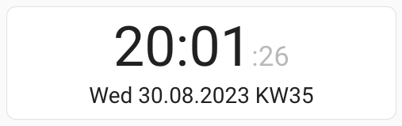
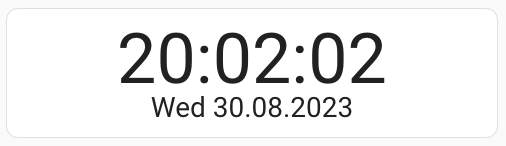
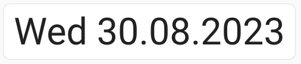

# Simple Date Time Clock Card for HomeAssistant

## Description
This card should be an easy to configure and bring you rich features on the same time. Also for that reason you can find all properties to configure, an explanation of them and samples below.

## Properties
### Global

| Name | Type | Default | Description |
|--|--|--|--|
| `global_text_align` | `string` | `center` | Could be `center`, `left` or `right`. The alignment of the text |
| `global_padding_left_size` | `string` | `0px` | Inner space to the left. Unit is up to you |
| `global_padding_right_size` | `string` | `0px` | Inner space to the right. Unit is up to you |
| `global_padding_top_size` | `string` | `15px` | Inner space to the top. Unit is up to you |
| `global_padding_bottom_size` | `string` | `15px` | Inner space to the bottom. Unit is up to you |
| `global_update_interval_ms` | `int` | `1000` | Interval for updating the clock. Could be set higher to save power or if you doesn't display the seconds anyway. |

### Time
| Name | Type | Default | Description |
|--|--|--|--|
| `time_show` | `bool` | `true` | Sets the visibility of the time |
| `time_font_size` | `string` | `5em` | Size of the text of the time. Unit is up to you |
| `time_seperator_char` | `string` | `:` | Sets the char that is displayed between the hours and minutes or minutes and seconds |
| `time_seperator_blink` | `bool` | `false` | Let the `time_seperator_char` blink each second. Could also be usefull if seconds aren't displayed |
| `time_hours_24` | `bool` | `true` | Enables or disables the clock in 24h style. Else it would be 12h with AM/PM |
| `time_hours_lead_zero` | `bool` | `true` | Forces the value to two digits: 9 -> 09 |
| `time_minutes_lead_zero` | `bool` | `true` | Forces the value to two digits: 9 -> 09 |
| `time_seconds_font_size` | `string` | `2em` | Size of the text of the seconds. If undefined the value is the same than `time_font_size`. Unit is up to you |
| `time_seconds_show` | `bool` | `true` | Sets the visibility of the seconds |
| `time_seconds_lead_zero` | `bool` | `true` | Forces the value to two digits: 9 -> 09 |
| `time_seconds_visibility_percentage` | `string` | `100%` | Can dim the text of the seconds to more match the background |

  
### Date

| Name | Type | Default | Description |
|--|--|--|--|
| `date_show` | `bool` | `true` | Sets the visibility of the date |
| `date_locale` | `string` | `en-US` | The locale is used to translate the name of the week. See `date_week_day_name_show` |
| `date_seperator_char` | `string` | `.` | Sets the char that is displayed between the day and the month or the month and the year |
| `date_font_size` | `string` | `2em` | Size of the text of the date. Unit is up to you |
| `date_us_format` | `bool` | `false` | Sets the date format to us(MM.DD.YYYY) insteat the eu/default(DD.MM.YYYY) format |
| `date_days_lead_zero` | `bool` | `true` | Forces the value to two digits: 9 -> 09 |
| `date_week_day_name_show` | `bool` | `true` | Sets the visibility of the name of the week. |
| `date_week_day_name_long` | `bool` | `false` | Sets the length of the name of the week. Fri <=> Friday |
| `date_week_number_show` | `bool` | `false` | Sets the visibility of the week number of the year |
| `date_week_number_label` | `string` | `KW` | Sets the label that is shown before the number of the week. Could also be empty |
| `date_months_lead_zero` | `bool` | `true` | Forces the value to two digits: 9 -> 09 |
| `date_year_two_digit` | `bool` | `false` | Sets the year to two digits. 2023 -> 23 |

## Samples
### My favorit

    type: custom:simple-date-time-clock-card
	time_seconds_visibility_percentage: 30%
	time_seconds_font_size: 0.5em
	date_week_number_show: true

### No special config

    type: custom:simple-date-time-clock-card

### Minimal UI

    type: custom:simple-date-time-clock-card
    time_hours_24: true
    time_seconds_show: false
    date_week_day_name_show: false

### Just the Clock

    type: custom:simple-date-time-clock-card
    time_hours_24: true
    time_seconds_show: true
    date_show: false

### Just the Date

    type: custom:simple-date-time-clock-card
    time_show: false
    date_font_size: 5em
    date_week_day_name_show: true

## ToDo

 1. Sample with us date format
 2. Sample for time/date seperators
 3. Sample for two digit year